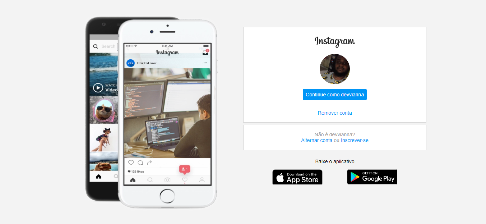

# # Instagram front-page project

## About

This is a simple project based on the frontpage of Instagram. This project was part of the Bootcamp offered by Everis on the Digital Innovation One platform, and was guided by Gabriela Pinheiro.

## Customization

I just used svg files for the logo and badges and customized the smartphones image.

## Demo

You can see the project running at:

[https://tedmartins.github.io/challenges/DIO-Instagram-Frontpage/](https://tedmartins.github.io/challenges/DIO-Instagram-Frontpage/)

